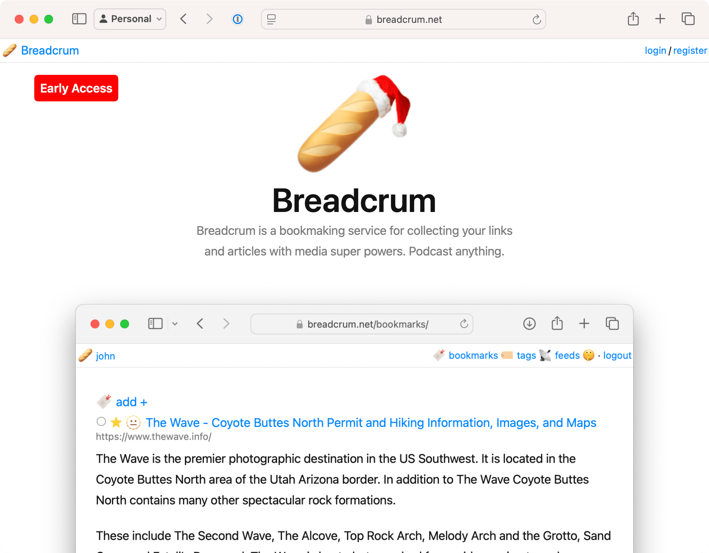

It looks like 2024 is about to end and there haven't been any udpates to Gumcast! Lets remedey that.

## Join Our Discord

Gumcast now has a Discord:

- [#gumcast Discord Chat]({{ vars.discordUrl }})

Feel free to join up to ask any questions or report issues with Gumcast, and check out the family of other [HifiWifi](https://hifiwi.fi) products.

## An Uneventful Year

Basically nothing happened this year! Gumcast continues to operate as normally, and Gumroad hasn't added any podcasting or RSS features to the core service, so we'll keep the lights on for another year as operational costs remain low.

## Heard of 🥖 Breadcrum?

Check out [breadcrum.net](https://breadcrum.net), a bookmarking service that lets you send video and audio from around the web directly to your favorite podcast app.

If you love Gumcast, you’ll enjoy Breadcrum—it makes consuming web content as seamless as enjoying your Gumroad content. Give it a try!

## Happy 2025

Wishing everyone a happy 2025! We hope Gumcast continues to bring you more value from your Gumroad content in the coming year.
