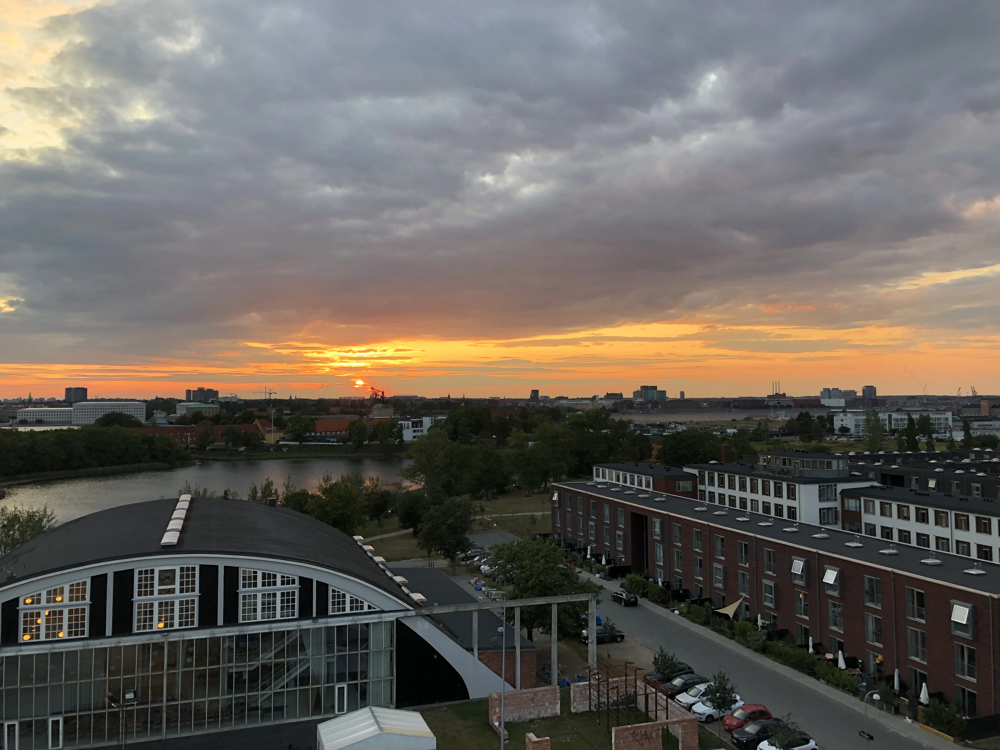

Gumcast is shutting down. After 6 successful years of providing RSS feeds to products on Gumroad and thousands of customers, I've decided to throw in the towel.

<figure>
  
  <figcaption>
    Gumcast was conceived on a bike ride in Denmark when the Gumroad app kept crashing while trying to stream over cell data.
  </figcaption>
</figure>

## But I'm relying on it!

Super duper sorry—I just can't justify spending any more time on the project.

Personally, the content I was watching on Gumroad has moved on to other platforms, and Gumroad itself has more than enough resources to add the features provided by Gumcast, so it's time (probably overdue, tbh) to pull the plug.

Encourage the content creators you support on Gumroad to move to a platform that supports podcast feeds.

## But my patrons are relying on it!

There are a bunch of places to host podcasts these days.
Until Gumroad improves its podcasting features, I strongly suggest offering your show on platforms that actually support podcast subscriptions.
Many of the most popular shows on Gumroad are now available on platforms like [Substack](https://substack.com), which have first-class podcasting support.
Many shows are also available on YouTube again, as it comes back down to earth with a [sane content moderation policy](https://archive.ph/15t4D).

If you really need help with a custom commercial solution, please reach out to [hifiwi.fi](https://hifiwi.fi/) for a consultation.

## Check out 🥖 Breadcrum.net

If your favorite content creators are publishing to public platforms like YouTube or X, please check out [🥖 Breadcrum.net](https://breadcrum.net/), a bookmarking platform that delivers content from around the web to your podcast app (kind of like Gumcast!).
This is a bootstrapped labor-of-love project I can actually justify working on. It's pretty unique, and you should definitely check it out!

## 6 Years and no RSS?

Sahil offered to acquire Gumcast the other year but got cold feet.
I assumed, with the excess resources available to the company, they decided they would just farm the feature out to a contractor or AI but this still hasn't happened. Oh well!
